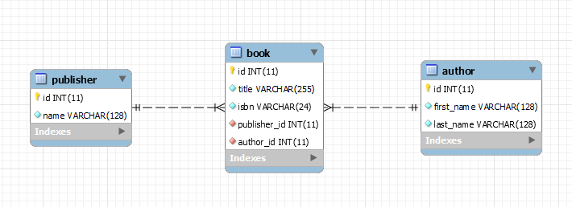

# Propel Bookstore CRUD Application

This repository contains a simple PHP CRUD (Create, Read, Update, Delete) application for a bookstore, using Propel as an ORM (Object-Relational Mapping) tool. The application demonstrates basic interactions with a database, managing books, authors, and publishers.

## Table of Contents

- [Requirements](#requirements)
- [Installation](#installation)
- [Configuration](#configuration)
- [Running the Application](#running-the-application)
- [Application Structure](#application-structure)
- [Contributing](#contributing)
- [Documentation and Resources](#documentation-and-resources)

## Requirements

- PHP 7.4 or newer
- MySQL or a compatible database
- Composer for PHP dependency management
- XAMPP or a similar local development environment

## Installation

1. **Clone the Repository**:
    ```bash
    git clone https://github.com/your-username/propel-bookstore.git
    cd propel-bookstore
    ```

2. **Install Dependencies**:
    ```bash
    composer install
    ```

## Configuration

1. **Database Setup**:
    - Create a new MySQL database for the application.
    - Adjust the database connection settings in the Propel configuration file (`propel.yaml` or similar).

2. **Propel Setup**:
    - Generate the Propel model classes:
      ```bash
      propel model:build
      ```
    - Create the `config.php` file:
      ```bash
      propel config:convert
      ```
    - Migrate your database schema:
      ```bash
      propel sql:build
      propel sql:insert
      ```

## Running the Application

Start your local PHP server in the project directory:

```bash
php -S localhost:8000
```

Then, open the application in your browser: [http://localhost:8000](http://localhost:8000)

## Application Structure

The application is structured as follows:

- `add_book.php`: Form to add a new book, including selecting an author and publisher.
- `list_books.php`: Lists all books with their respective authors and publishers.
- `update_book.php`: Form to update existing book details.
- `delete_book.php`: Interface to delete a book by ID.
- `index.php`: Main entry point linking to various operations.
- `propel.yaml`: Propel configuration file.
- `schema.xml`: Propel schema file defining the database structure.
- `config.php`: Generated Propel configuration file.
- `vendor/`: PHP dependencies managed by Composer.
- `composer.json`: Composer configuration file.

## EER Diagram

Here's the Enhanced Entity-Relationship diagram for the bookstore application:




## Contributing

Contributions to improve the application or documentation are welcome. Please follow the standard GitHub flow - fork the repository, make your changes, and submit a pull request.

## Documentation and Resources

- [Propel ORM Documentation](http://propelorm.org/Documentation/)
- [PHP Official Documentation](https://www.php.net/docs.php)
- [Composer Dependency Manager](https://getcomposer.org/doc/)
